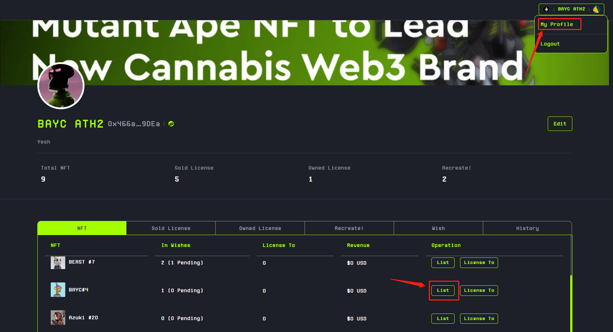

# 💰 List NFT License on CGMI

**We offer two modes, sell through Explore or join Wish.**



## Step 1 - Pick NFT

In your My Profile -> NFT, you can see a list of all NFTs that are supported for trading license on CGMI.

<figure><figcaption></figcaption></figure>

## Step 2 - Create List

After clicking 'List', you can set different unit prices (daily prices) for its various purposes. During the transaction process, a certain percentage of the fees paid by the buyer will be allocated to the platform and the NFT project party.

<figure><figcaption></figcaption></figure>


If you are listing an NFT License from this collection for the first time, an additional signature will be necessary to enable the creation of the License NFT at a later stage.


## Step 3 - View in Explore

After listing, you can see the listed NFT License in the Explore feature, where you can view and remove it.

<figure><figcaption></figcaption></figure>

<figure><figcaption></figcaption></figure>

## Step 4 - Claim Rewards

You can check the NFT Licenses that have already been sold in the Sold License section under My Profile. By clicking on 'Claim', you can claim the earnings from the portion that has been released.

<figure><figcaption></figcaption></figure>



## Step 0 - Select Collection

First, you need to select the NFT Collection according to your NFT assets.&#x20;

After selecting, you can view the Marketplace under that NFT Collection.

## Step 1 - Find Wish

You can choose an active wish in the Wish section.

<figure><figcaption></figcaption></figure>

## Step 2 - Engage

Select the NFT you wish to join in the Wish, and complete the signature to proceed.

<figure><figcaption></figcaption></figure>

## Step 3 - Claim Rewards

If your NFT is selected, you can check Sold License section under My Profile. By clicking on 'Claim', you can claim the earnings from the portion that has been released.

<figure><figcaption></figcaption></figure>



##

##

